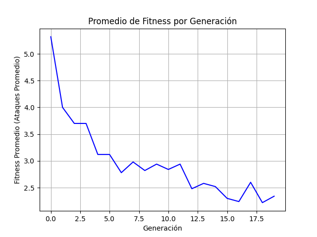

# Genéticos y 8 reinas

La resolución del problema de las 8 reinas mediante algoritmos genéticos implica el uso de técnicas basadas en la evolución biológica para encontrar una disposición de 8 reinas en un tablero de ajedrez de 8x8, de modo que ninguna reina amenace a las demás. Se considera una población de posibles soluciones, aplicando métodos como selección, cruza y mutación para evolucionar y mejorar gradualmente las soluciones a lo largo de las generaciones. El objetivo es encontrar la disposición óptima que cumpla con las restricciones del problema.

Se hace uso del lenguaje de programación Python, la paquetería `random` y los siguientes métodos de algoritmos genéticos.

| Representación      | Permutación                           |
|---------------------|----------------------------------------|
| Inicialización      | Aleatoria |
| Selección de padres | Universal estocástica |
| Cruza               | A los extremos                      |
| Mutación            | Mezcla                                |
| Reemplazo           | Brecha generacional |

A diferencia de la representación binaria o entera, la representación de permutación mantiene la propiedad de que cada posible valor de alelo puede ocurrir exactamente una vez en cada solución. En el problema de las 8 reinas, se representa cada solución como una lista de las filas en las que se posiciona cada reina, cada una en una columna diferente, y necesita ser una permutación para que ninguna de las dos reinas compartiera la misma fila.

Primero, con ayuda de la inicialización aleatoria (_randomly generated individuals_) se generan una población inicial de forma completamente aleatoria. La función `pob(n)` genera una población de 'n' individuos, y esta a su vez utiliza la función `individuo()` que los genera. 

La función del _fitness_ suma los ataques que se realizan en el individuo, esto es, cuando la distancia entre los alelos es igual a la distancia entre los genes. Luego devuelve como fitness al número de ataques.

En la selección de padres estocástica (_stochastic universal sampling_), la idea principal es seleccionar a los padres de manera proporcional a su fitness en función de una probabilidad acumulada. Es decir, los individuos con mejor fitness tienen mayor probabilidad de ser seleccionados como padres. Siguiendo esta idea, se define la función `proba_ac(pob)` que guarda las probabilidades acumuladas de los elementos de 'pob' en una lista. Luego la función `seleccion_padres(poblacion, lam)` recibe a la población y al número lamda que es igual a la cantidad de padres que se toma de la población.

La cruza de los extremos (_edge crossover_) se basa en la idea de que la descendencia debería crearse utilizando únicamente extremos que están presentes en uno de los padres. Para realizar esto, se construye una tabla de extremos, la cual para cada elemento enumera los otros elementos que están vinculados a él en los dos padres. El operador funciona de la siguiente manera:
1. Se construye la tabla de extremos
2. Elegir un elemento inicial al azar y colocarlo en el hijo.
3. Establecer la variable 'current_element' = entry
4. Elimina todas las referencias a 'current_element' de la tabla.
5. Examinar la lista de 'current_element'
   - Si hay un borde común, elegirlo como el próximo elemento.
   - En caso contrario, seleccionar la entrada en la lista que tenga la lista más corta.
   - Las situaciones de empate se resuelven al azar.
6. En el caso de llegar a una lista vacía, se selecciona el 'new_element' de manera aleatoria.
Así, para crear la tabla de extremos se implementa la función `crear_tabla(papa, mama)` para despues utilizarla en la función `cruza_extremos`. Esta última sigue los pasos de la cruza de extremos mencionada anteriormente.

En la mutación de mezcla (_scramble mutation_), implementada en la función `mezcla(individuo)` se toma ya sea todo el cromosoma o un subconjunto seleccionado al azar, y se reorganizan sus posiciones de manera aleatoria.

Finalmente, se utiliza el remplazo de brecha generacional (_replace worst genitor_),  donde la función `brecha_generacional(padres, hijos, lam)` eliminan 'lambda' individuos menos aptos de la generación actual y se remplazan por los hijos, lo cual permite que la nueva generación sea sucesora de los individuos con mejor fitness.

Al implementar el código, podemos ver como conforme pasan las generaciones, más soluciones al problema van surgiendo. Podemos graficar el promedio del fitness de la población con respecto a su generación. 

Vemos que con el paso de las generaciones, el fitness mejora progresivamente, indicando una convergencia hacia soluciones óptimas. Así los métodos de algorítmos genéticos muestran ser de gran utilidad en la resolución de este problema.